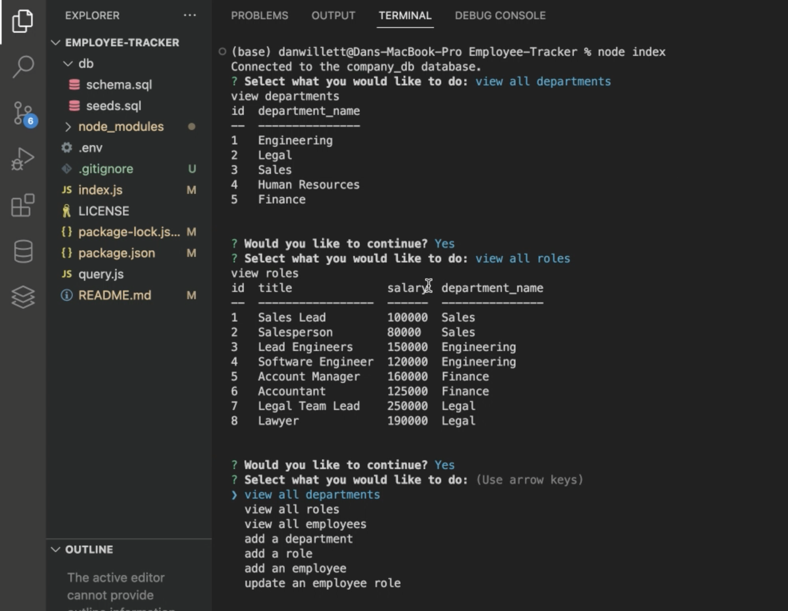

# Employee-Tracker

## Description

This project was created to help employers track their employee's information within the company such as role, salary, and department within a databse. This application enables employers to add new departments, roles, employees, as well as update employee roles.

## Installation

Clone this repository from github and install the dependencies listed in package.json using node.js and npm.
Run the schema.sql file in mysql to set up the database. Run `node index` in your terminal to open the application.

## Usage

When start the application, you will be prompted view, add, or update the departments, roles, and employees in your database. Choose from the list of prompts by navigating to your chosen action, then pressing enter. If you selected to view your current departments, roles, or employees, you will be presented with a formatted table containing the information in your database. If you select to add to or update your departments, roles, or employees, you will asked to enter additional information. Answer these prompts, and your database will be updated and you will be shown an updated table containing the new information.

## Credits

Inquirer docs: https://www.npmjs.com/package/inquirer
mysql2 docs: https://www.npmjs.com/package/mysql2?activeTab=readme

## License

MIT license